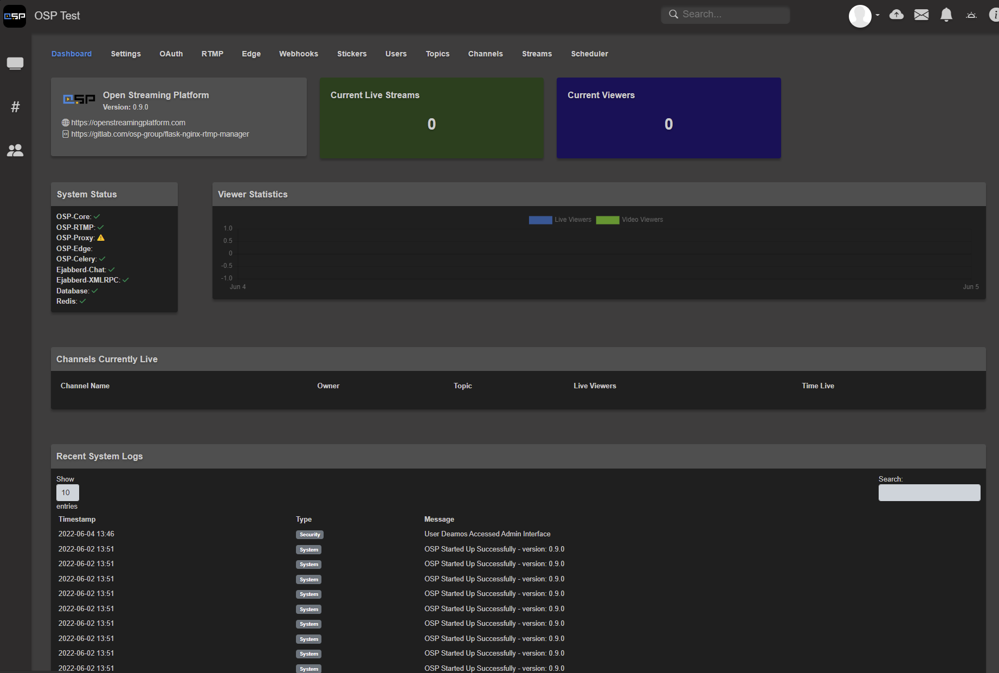

# Admin Settings
## Dashboard
The OSP Dashboard contains a snapshot of information regarding the active state of the system.  OSP Version number, Current Live Streams, Current Viewers, System Status, and System Logs can be found here.



## Settings
### General Settings
- ```Server Name```: Sets the Displayed Name of the OSP Instance.  This is shown in the navbar, emails, headers, etc.
- ```Protocol```: This should be the User Side HTTP(S) protocol used to access OSP
- ```Hostname / IP Address```: User Side Domain used to access the OSP instance
- ```OSP-Proxy Hostname```: Fully Qualified Domain Name for OSP-Proxy, if used. Should be blank if no OSP-Proxy in use.
  - If you are using more than one proxy, this should be the Fully Qualified Domain Name for your OSP-Proxy Load Balancer
- ```Time Zone```: System Timezone of the OSP Server.  This will adjust Date Time values to match the set Time Zone
- ```Maintenance Mode```: Places OSP into Maintenance Mode where a Static Page will show for all users.  Only Admins may log in.
### Appearance
- ```Logo```: OSP System Logo to be shown for the server.  42w x 42h is recommended
- ```Theme```: Server Theme to be displayed to all users.
- ```Front Page Layout```: Global Panels and Order of Display on the Main Page (http(s)://osp.example.com/)
  - Only Global Panels may be added to this list
  - You can reorder by dragging the entry in the list and click ```Save```
- ```Show Empty Channels and Topics on Built-in Pages```: This will show Channels and Topics which do not have a Live Stream, Video, or Clip Associated with them.  If turned off, these will not display in the list when empty.
- ```Server Announcement Header Title```: Header Title of the System Announcement Bar shown on the Main Page
- ```Announcement Message```: System Announcement Shown on the top of the Main Page.  Leave Blank to not display.
### Channels
- ```Enable Recordings```: Globally allows users to record live streams
- ```Enabled Uploads```: Globally allows users to upload videos (Still requires uploader role)
- ```Enable Video/Clip Comments```: Globally allows users to leave comments on videos and clips
- ```Enable Channel Protection System```: Globally enables OSP's channel protection system, allowing users to prevent unauthorized viewers from accessing channel content.  Users can set channel protection on a per-channel basis
- ```Enable RTMP Restreams```: Globally allows users to restream live streams on OSP to another RTMP server
- ```Enable Adaptive Streams```: Globally enables Adaptive Streaming.
  - **Important Note:** Adaptive Streams are significantly CPU intensive and should only be enabled on servers which have FFMPEG Hardware Acceleration configured and have modified the Nginx-RTMP Conf Files to use HW Acceleration.  If you have not done this, DO NOT TURN THIS ON.
- ```Maximum Retention for Recordings Before Deletion (days)```: Sets the Retention for Videos and Clips.  Users will be notified when nearing the retention date for a video/clip. Setting to 0 will set for indefinite retention. This setting will take precedent if a user sets a higher retention setting in their channel.
- ```Maximum Allowed # of Channels per User```: Maximum number of channels a user can create in their account.  Set to 0 for no restriction
- ```Maximum Bitrate for RTMP Restream (Kb/s)```: Sets the bitrate used by the RTMP Restream process
- ```Maximum Clip Length```: Sets the maximum length a video clip can be when creating a new clip
- ```Banned Chat Words```: Sets words which are banned in chat and will be censored
### Global Panels
-  ```Panel Name```: Panel name identifier for the global panel
-  ```Panel Header Label```: Displayed header label for a panel
-  ```Panel Type```: Sets the Panel Type to be displayed
   -  ```Custom Markdown/Text```: Markdown formatted panel
   -  ```Live Stream List```: List of all active Live Streams on the instance
   -  ```Video List```: Lists Videos on the OSP instance
   -  ```Clip List```: Lists Clips on the OSP instance
   -  ```Topic List```: Lists Topics on the OSP instance
   -  ```Channel List```: Lists Channels on the OSP Instance
   -  ```Featured Live Channel```: Displays the Live Stream of the Target Channel when Live along with Content
- ```Panel Order```: Sets the Display Order of List Panel Types
- ```Content```: Displays Markdown Data in the panel where available
### Static Pages
- ```Page Title```: Name of the Static Page
- ```Page URL```: URL Slug for the static page.  Will be accessible via /p/$val
- ```Icon```: Icon Class Name for the Static Page.  Should be the Font Awesome class name as found at https://fontawesome.com/search?m=free
- ```Display in Top Navbar```: Displays the Static Page in the top navbar, instead of the left sidebar
- ```Page Content```: Markdown Content to be displayed