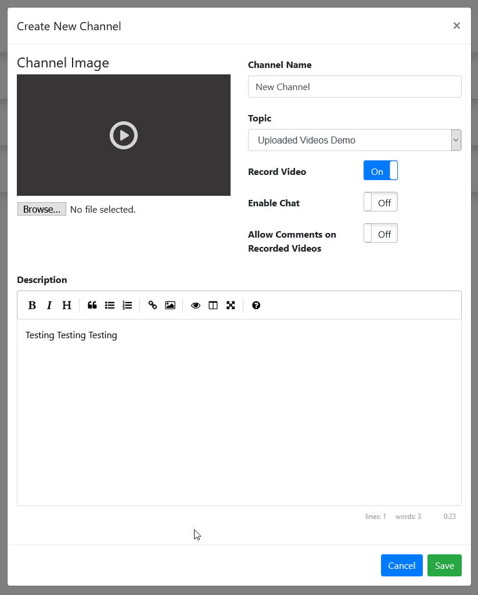

# Channels
OSP's core concept is the idea of Channels.  Channels act as a separate unit of configuration for videos, clips, and streams.  By changing OSP Channel Settings, you can enable invite-only settings, turn on/off chat, set offline stream images, set channel-level webhooks and more.  All videos associated with a channel will take the settings of the channel, including invite protections.  Each channel with also maintain its own Stream Key.

## Creation
To create a new channel, go to the top bar menu under your user name and select My Channels.

Next, click the Create Channel Button and Input the information on your new channel in the windows that pops up.

## Protection
OSP offers the ability to require authentication to view Channel Streams, Videos, and Clips. By default, this setting is disabled to reduce overhead. When enabled, OSP verified that users are authorized to view all media, which can cause a delay while the system queries access.

To enable Channel Protections, go to the Admin Page -> Settings and turn on "Enable Channel Protections". Once this setting has been enabled Channel Owners can enable protection on their channels and require viewers have been explicitly invited or have an invite code, that has been generated by the channel owner.

## Chat Settings

- **Room Title**: Name of Room (displayed to XMPP Chat Clients)
- **Description**: Room description (displayed to XMPP Chat Clients)
- **Chat message format**: Changes the appearance of chat messages.
  - **Messenger**: Separates every message into it's own "bubble".  
  
  - **IRC**: A more Twitch-Like experience.  
  
- **Moderated**: Only Users Identified as Participants may Chat
- **Allow guests to join room**: Allow Unauthenticated Guest Users to Join the Chat
- **Allow guests to chat**: Automatically set Unauthenticated Guest Users as Participants.
- **Allow guests to set their Nickname**: Allows and asks Unauthenticated Guest Users to set a Nickname.
- **Show join and part messages**: Shows in chat when Users connect and disconnect from the Chat.
- **Chat history**: How long chat messages should be displayed in the Web Chat. (Does not affect 3rd Party Clients! Restart ejabberd to clear history!)
- **Moderators**: Add and Remove Chat Moderators from this Channel.
- **Chat Stickers**: Upload and Manage stickers (essentially custom emojis) for this channel. The OSP Instance Admin can also define Global Stickers which will show up on all channels.

Check _[Installation > OSP Configuration](https://osp-docs-epiclper.readthedocs.io/en/latest/install/install.html#osp-configuration)_ for a more detailed description of the individual settings.