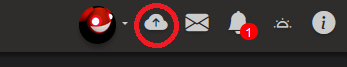
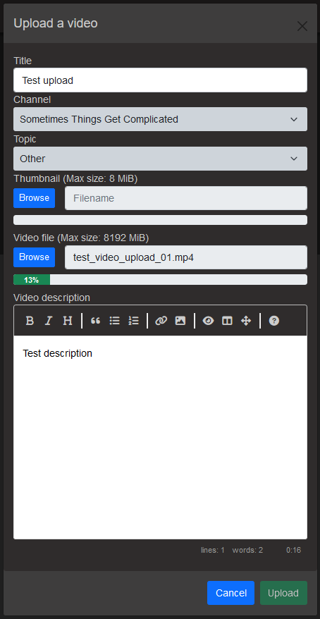
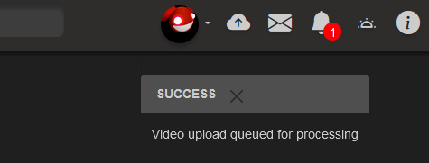

# Uploading Video
OSP provides the ability for Users to upload video directly to the system without streaming. This may be useful in cases where post-production needs to be added to a previously recorded video.

## Setup
To upload video to OSP, a few settings must be configured by the Administrator

Under Admin -> Settings, the "Enable Uploads" setting must be enabled.
Users which will be uploading video must be granted the Uploader Role under Admin -> Users.

Additionally, the "Maximum Video Upload File Size (MiB)" and "Maximum Video Thumbnail File Size (MiB)" settings can be configured to specify the file size limit (in MiB) of videos and thumbnails to be uploaded. They must each have a value no less than 1 MiB.

Already uploaded videos and thumbnails whose sizes happen to exceed the current size limits will not be automatically deleted.

## Limitations
- Users must have a channel setup prior to uploading
- Videos must be in H.264 MP4 fomat
- Videos must be no bigger than the site's "Maximum Video Upload File Size (MiB)" limit.

## How to Upload
1) Click on this "Upload" button in the top-right bar to show the Video Upload modal

2) Add A Title, Select your Channel, and Add a Video File. Thumbnail and Description are optional. If no thumbnail is added, one will be generated automatically. Click Upload when you are Done.

3) If the video upload is successful, a notification will appear stating the video upload is queued for processing. Eventually, the video will show up in your channel's Video list when the upload is complete.
